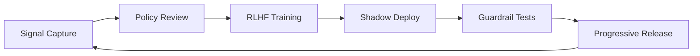

{/* editorial: tone="Pragmatic, operational" keywords="continuous learning, reinforcement learning, enterprise guardrails" */}

## Feedback loops must be auditable

Continuous learning cannot devolve into opaque experimentation. Apotheon.ai anchors every loop to three checkpoints:

- **Signal collection** — Pagefind analytics, in-product surveys, and API logs land in a centralized telemetry lake with per-tenant partitions.
- **Evaluation** — Automated scorers measure drift, bias, and hallucination rates; escalations spawn tickets routed to responsible reviewers.
- **Deployment** — Feature flags manage gradual rollouts with rollback hooks tied to the AIOS control plane.

> “If you cannot answer who reviewed a model change and when, the change should not ship.”

### Loop orchestration snapshot

### Metrics dashboard

| KPI              | Target       | Automation                                 |
| ---------------- | ------------ | ------------------------------------------ |
| Review SLA       | < 24 hours   | PagerDuty escalation from governance queue |
| Drift detection  | < 15 minutes | Streaming detectors wired to OpenTelemetry |
| Rollback latency | < 5 minutes  | GitOps pipeline with verified rollbacks    |

### Launch checklist

1. Verify all RLHF datasets are cataloged with retention schedules.
2. Confirm product and legal teams signed off on the upcoming change set.
3. Capture before/after metrics in the shared Looker dashboard for historical audits.

The launch posts now give you recipes for hooking these controls into the AIOS. Stay tuned for automation scripts that push reinforcement learning events into the same OG Worker queue shipping social art.
